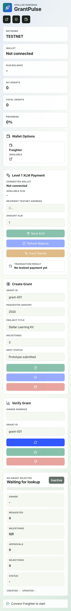
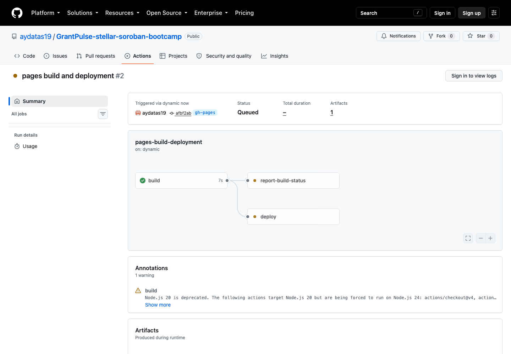
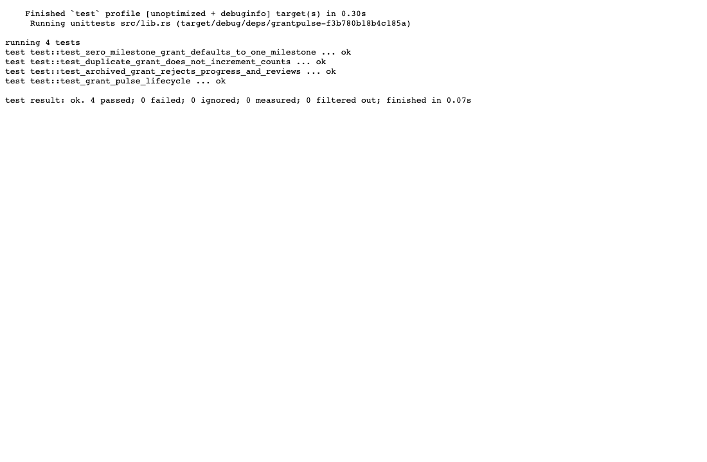

# GrantPulse Stellar

GrantPulse is a Stellar Soroban dApp for tracking mini grants, hackathon projects, and milestone-based builder progress on-chain.

## Project Name

- GrantPulse Stellar

## About Me

- name: Your Name
- Building with Stellar Soroban
- Interested in transparent funding, project progress, and useful blockchain records
- Learning how smart contracts, wallets, and frontends work together
- Creating a project that can be customized for bootcamps, hackathons, and demo days

## Project Details

GrantPulse lets a project owner create an on-chain grant record with a title, requested amount, and milestone count. The owner can mark milestones as completed, archive the grant, and show progress publicly. Reviewers can connect their Freighter wallet and approve or reject a grant once. The smart contract stores the grant owner, grant ID, requested amount, milestone progress, review counts, timestamps, and active status.

The frontend also includes the Level 1 White Belt wallet flow: connect Freighter on Stellar Testnet, disconnect the wallet, fund the connected testnet account with Friendbot, display the native XLM balance, and send a testnet XLM transaction with success or failure feedback.

## Level 1 White Belt Features

- Freighter wallet connection and disconnect controls.
- Stellar Testnet network validation before wallet, balance, grant, and payment actions.
- Friendbot funding button for the connected Testnet wallet.
- Native XLM balance lookup through Horizon Testnet.
- XLM transfer form with recipient address and amount inputs.
- Payment transaction signing through Freighter and submission to Horizon Testnet.
- Transaction result panel with success or failure state and a Stellar Expert transaction hash link.
- Beginner-friendly error handling for invalid addresses, invalid amounts, unfunded source accounts, and new recipient accounts.

## Vision

GrantPulse helps small teams prove progress without relying only on private forms or spreadsheets. A bootcamp, hackathon, or community program can use it to show which projects exist, how far they have moved, and how reviewers responded. It gives new builders a practical way to learn wallet authorization, smart contract storage, and public verification while creating a funding workflow that feels useful in real life.

## Development Plan

1. Create Soroban storage keys for grants, reviewer actions, each owner's grant count, and total grant count.
2. Add `create_grant(owner, grant_id, title, requested_amount, milestone_count)` with wallet authorization and duplicate protection.
3. Add `complete_milestone(owner, grant_id, status)` and `archive_grant(owner, grant_id)` for owner-controlled progress updates.
4. Add `review_grant(reviewer, owner, grant_id, approved)` so reviewers can approve or reject once.
5. Build a React frontend with Freighter wallet connection, Testnet XLM balance display, XLM payment flow, grant creation, progress updates, review buttons, and verification cards.
6. Test, build, generate TypeScript bindings, deploy to Stellar Testnet, and connect the deployed contract ID to the frontend.

## Smart Contract

Main contract:

```text
contracts/grantpulse
```

Functions:

```text
create_grant(owner: Address, grant_id: String, title: String, requested_amount: u32, milestone_count: u32) -> u32
complete_milestone(owner: Address, grant_id: String, status: String) -> u32
review_grant(reviewer: Address, owner: Address, grant_id: String, approved: bool) -> bool
archive_grant(owner: Address, grant_id: String) -> bool
get_grant(owner: Address, grant_id: String) -> Grant
get_progress(owner: Address, grant_id: String) -> u32
get_grant_count(owner: Address) -> u32
get_total_grants() -> u32
```

## Deployed Contract

- Network: Stellar Testnet
- Contract ID: `CDNCS5MQUHT2XAOITMC74U7SKKDHQ4WJMEDNLLKFSMESSOK3SSNNFMWV`
- Explorer: <https://stellar.expert/explorer/testnet/contract/CDNCS5MQUHT2XAOITMC74U7SKKDHQ4WJMEDNLLKFSMESSOK3SSNNFMWV>

## Level 2 Submission Evidence

- Public repository: <https://github.com/aydatas19/GrantPulse-stellar-soroban-bootcamp>
- Live demo: <https://aydatas19.github.io/GrantPulse-stellar-soroban-bootcamp/>
- Meaningful commits: 12 total commits on `main` after the Level 3 review response update
- Wallet options screenshot: `docs/screenshots/wallet-options-available.png`
- Deployed contract address: `CDNCS5MQUHT2XAOITMC74U7SKKDHQ4WJMEDNLLKFSMESSOK3SSNNFMWV`
- Contract call transaction hash: `1f49394a95040b8c3ac1651f8727b4346eee33e21e5e5c674d9d1654b611f485`
- Contract call Explorer link: <https://stellar.expert/explorer/testnet/tx/1f49394a95040b8c3ac1651f8727b4346eee33e21e5e5c674d9d1654b611f485>
- Contract call function: `create_grant`
- Contract call grant ID: `level2-evidence-20260813-2119`

## Level 3 Submission Evidence

- Public GitHub repository: <https://github.com/aydatas19/GrantPulse-stellar-soroban-bootcamp>
- Live demo link: <https://aydatas19.github.io/GrantPulse-stellar-soroban-bootcamp/>
- Meaningful August commits: 11 commits on `main` from 2026-08-01 through 2026-08-14 after the Level 3 review response update
- August commit evidence: `docs/submission/level3-august-commit-evidence.md`
- Contract deployment address: `CDNCS5MQUHT2XAOITMC74U7SKKDHQ4WJMEDNLLKFSMESSOK3SSNNFMWV`
- Contract interaction transaction hash: `1f49394a95040b8c3ac1651f8727b4346eee33e21e5e5c674d9d1654b611f485`
- Contract interaction Explorer link: <https://stellar.expert/explorer/testnet/tx/1f49394a95040b8c3ac1651f8727b4346eee33e21e5e5c674d9d1654b611f485>
- CI/CD pipeline run: <https://github.com/aydatas19/GrantPulse-stellar-soroban-bootcamp/actions/runs/31785070761>
- Demo video link: [GrantPulse Level 3 demo video](docs/demo/grantpulse-level3-demo.webm)

Level 3 screenshots:







## Level 4 Green Belt Readiness

GrantPulse now includes a production-readiness layer for Level 4 validation:

- In-app Level 4 Validation panel for wallet sessions, wallet-backed interactions, proof hashes, feedback count, runtime errors, and latest telemetry events.
- Runtime error monitoring for browser errors and unhandled promise rejections.
- Local analytics storage with optional `VITE_ANALYTICS_ENDPOINT` forwarding.
- In-app user feedback collection with optional `VITE_FEEDBACK_ENDPOINT` forwarding.
- Evidence export as JSON from the live app.
- Generated Soroban TypeScript binding in `frontend/packages/grantpulse/src/index.ts`.
- Typed frontend contract client with Freighter signing in `frontend/src/lib/grantpulse.ts`.
- React UI calls for every public smart contract function in `frontend/src/App.tsx`.
- GitHub Pages production deployment workflow in `.github/workflows/deploy-pages.yml`.
- Automated CI checks for Rust format, Clippy, contract tests, Soroban WASM build, frontend integration, and frontend production build.

Level 4 submission links and files:

- Public GitHub repository: <https://github.com/aydatas19/GrantPulse-stellar-soroban-bootcamp>
- Live demo link: <https://aydatas19.github.io/GrantPulse-stellar-soroban-bootcamp/>
- Contract deployment address: `CDNCS5MQUHT2XAOITMC74U7SKKDHQ4WJMEDNLLKFSMESSOK3SSNNFMWV`
- Contract Explorer link: <https://stellar.expert/explorer/testnet/contract/CDNCS5MQUHT2XAOITMC74U7SKKDHQ4WJMEDNLLKFSMESSOK3SSNNFMWV>
- Level 4 checklist: `docs/submission/level4-checklist.md`
- Level 4 revision response: `LEVEL4_REVISION_RESPONSE.md`
- Level 4 resubmission evidence: `docs/submission/level4-resubmission-evidence.md`
- Production ops notes: `docs/submission/level4-production-ops.md`
- Real wallet interaction template: `docs/submission/level4-user-wallet-interactions.csv`
- User feedback summary template: `docs/submission/level4-feedback-summary.md`
- CI/CD workflow: `.github/workflows/deploy-pages.yml`
- Frontend integration verification: `frontend/scripts/verify-contract-integration.mjs`
- Product UI screenshot: `docs/screenshots/level4-product-ui.png`
- Mobile responsive screenshot: `docs/screenshots/level4-mobile-responsive-ui.png`
- Analytics and monitoring screenshot: `docs/screenshots/level4-analytics-monitoring.png`

Before final Level 4 submission, replace the placeholder evidence files with:

- 10+ real user wallet interaction rows with Stellar Expert transaction URLs.
- A feedback summary based on real tester responses.
- A new Level 4 demo video link.
- Updated screenshots for product UI, mobile responsive UI, and analytics/monitoring setup.

## Level 5 Blue Belt Readiness

GrantPulse now includes a Level 5 growth layer focused on onboarding 50 real testnet users, collecting named feedback, exporting submission evidence, and preparing the project for a pitch/demo review.

Level 5 submission links and files:

- Public GitHub repository: <https://github.com/aydatas19/GrantPulse-stellar-soroban-bootcamp>
- Live demo link: <https://aydatas19.github.io/GrantPulse-stellar-soroban-bootcamp/>
- Deployed contract: `CDNCS5MQUHT2XAOITMC74U7SKKDHQ4WJMEDNLLKFSMESSOK3SSNNFMWV`
- Contract Explorer: <https://stellar.expert/explorer/testnet/contract/CDNCS5MQUHT2XAOITMC74U7SKKDHQ4WJMEDNLLKFSMESSOK3SSNNFMWV>
- Pitch deck: [docs/pitch/grantpulse-level5-pitch-deck.pptx](docs/pitch/grantpulse-level5-pitch-deck.pptx)
- Demo recording script: [docs/demo/level5-demo-script.md](docs/demo/level5-demo-script.md)
- Level 5 checklist: [docs/submission/level5-checklist.md](docs/submission/level5-checklist.md)
- Level 5 commit evidence: [docs/submission/level5-commit-evidence.md](docs/submission/level5-commit-evidence.md)
- Google Form setup guide: [docs/submission/level5-google-form-questions.md](docs/submission/level5-google-form-questions.md)
- Exported Excel feedback workbook: [docs/submission/level5-user-feedback-export.xlsx](docs/submission/level5-user-feedback-export.xlsx)
- CSV column template: [docs/submission/level5-user-onboarding-template.csv](docs/submission/level5-user-onboarding-template.csv)
- Growth campaign plan: [docs/submission/level5-growth-campaign-plan.md](docs/submission/level5-growth-campaign-plan.md)
- User proof review guide: [docs/submission/level5-user-proof-review.md](docs/submission/level5-user-proof-review.md)
- Feedback analysis guide: [docs/submission/level5-feedback-analysis-guide.md](docs/submission/level5-feedback-analysis-guide.md)
- Submission manifest: [docs/submission/level5-submission-manifest.md](docs/submission/level5-submission-manifest.md)
- Feedback iteration summary: [docs/submission/level5-feedback-iteration-summary.md](docs/submission/level5-feedback-iteration-summary.md)
- Desktop Level 5 screenshot: [docs/screenshots/level5-growth-proof.png](docs/screenshots/level5-growth-proof.png)
- Level 5 growth panel screenshot: [docs/screenshots/level5-growth-panel.png](docs/screenshots/level5-growth-panel.png)
- Mobile Level 5 screenshot: [docs/screenshots/level5-mobile-growth-proof.png](docs/screenshots/level5-mobile-growth-proof.png)

Current Level 5 status:

- Meaningful commits: 20 Level 5-specific commits on `main` listed in `docs/submission/level5-commit-evidence.md`
- Validation: `npm run build` passes and `cargo test` passes with 4 contract tests
- Product improvements: Level 5 growth dashboard, required tester identity fields, wallet-linked feedback, transaction proof hash/URL validation, readiness metrics, CSV export, updated JSON evidence bundle, Excel workbook, pitch deck, and demo script
- Published Google Form link: `TODO - create using docs/submission/level5-google-form-questions.md and paste the public form URL here`
- Demo video link: `TODO - record using docs/demo/level5-demo-script.md and paste the video URL here`
- Proof of 50+ users: `TODO - replace the workbook with the real Google Form Excel export after 50+ testers submit wallet and transaction proof`
- Analytics or transaction activity screenshots: `TODO - add screenshots after the 50-user testnet campaign`

Level 5 feedback-driven improvements:

- Added a Level 5 growth proof dashboard and CSV/JSON evidence exports: <https://github.com/aydatas19/GrantPulse-stellar-soroban-bootcamp/commit/d423939>
- Documented the Google Form onboarding workflow, Level 5 checklist, and demo script: <https://github.com/aydatas19/GrantPulse-stellar-soroban-bootcamp/commit/67d7482>
- Added the Excel feedback workbook for Google Form export analysis: <https://github.com/aydatas19/GrantPulse-stellar-soroban-bootcamp/commit/5500d39>
- Added the Level 5 pitch deck and updated product screenshots: <https://github.com/aydatas19/GrantPulse-stellar-soroban-bootcamp/commit/550fe57>

Next phase evolution plan based on the 50-user feedback campaign:

1. Review the exported Excel workbook for the lowest ratings, repeated onboarding blockers, and missing proof rows.
2. Prioritize one onboarding fix, one reviewer workflow improvement, and one trust/proof improvement.
3. Commit the highest-impact product change and add the new commit link to the Level 5 feedback iteration summary.
4. Update the pitch deck traction slide with the final user count, average rating, transaction proof count, and strongest feedback themes.
5. Record the final walkthrough using the real 50-user evidence and link the video here before submission.

## Tech Stack

- Stellar Soroban smart contract
- Rust
- React
- TypeScript
- Vite
- Freighter wallet
- Stellar Testnet

## Installation

Before running the dApp, install the Freighter browser extension and switch it to Stellar Testnet.

Install the Soroban target:

```bash
rustup target add wasm32v1-none
```

Run contract tests:

```bash
cargo test
```

Build the contract:

```bash
stellar contract build
```

Generate TypeScript bindings after deployment:

```bash
stellar contract bindings typescript \
  --network testnet \
  --contract-id grantpulse \
  --output-dir frontend/packages/grantpulse
```

Install and build the generated binding:

```bash
cd frontend/packages/grantpulse
npm install
npm run build
cd ../..
```

Install and run the frontend:

```bash
cd frontend
npm install
npm run dev
```

Open:

```bash
http://localhost:4328
```

Optional frontend environment override:

```bash
VITE_HORIZON_URL=https://horizon-testnet.stellar.org
```

## How to Test Level 1

1. Open the app locally and click `Connect`.
2. Approve the Freighter request with a Testnet account selected.
3. Confirm the dashboard shows the connected wallet and XLM balance.
4. Click `Fund Testnet` if the wallet needs testnet XLM.
5. Enter a recipient Testnet public key and an XLM amount.
6. Click `Send XLM`, approve the Freighter signature request, and wait for the result panel.
7. Open the transaction hash link to verify the transaction on Stellar Expert Testnet.
8. Click `Disconnect` to clear the wallet session from the UI.

If the recipient account does not exist yet, the app uses a Stellar `createAccount` operation instead of a payment operation. In that case, send at least `1 XLM`.

## Submission Screenshots

Level 2 wallet options screenshot:


Additional Level 1 test screenshot paths:

- `docs/screenshots/mobile-responsive-ui.png`
- `docs/screenshots/cicd-pages-pipeline.png`
- `docs/screenshots/test-output-4-passing.png`
- `docs/screenshots/wallet-connected.png`
- `docs/screenshots/balance-displayed.png`
- `docs/screenshots/successful-testnet-transaction.png`

The successful transaction screenshot should show the transaction result panel with the Stellar Testnet transaction hash.

## Visual Concept

- Mascot: robot grant coordinator
- Setting: bright builder studio with project boards and funding signals
- Physical keywords: checking milestones, approving progress, launching projects
- Art direction: futuristic happy digital painting with transparent funding dashboards, energetic builders, clean blockchain signals, and confident progress

## Useful Links

- Stellar Developer Documentation: <https://developers.stellar.org/docs>
- Freighter Documentation: <https://docs.freighter.app/docs>
- Stellar Chain Explorer: <https://stellar.expert/explorer/testnet>
- Stellar Lab: <https://lab.stellar.org>
